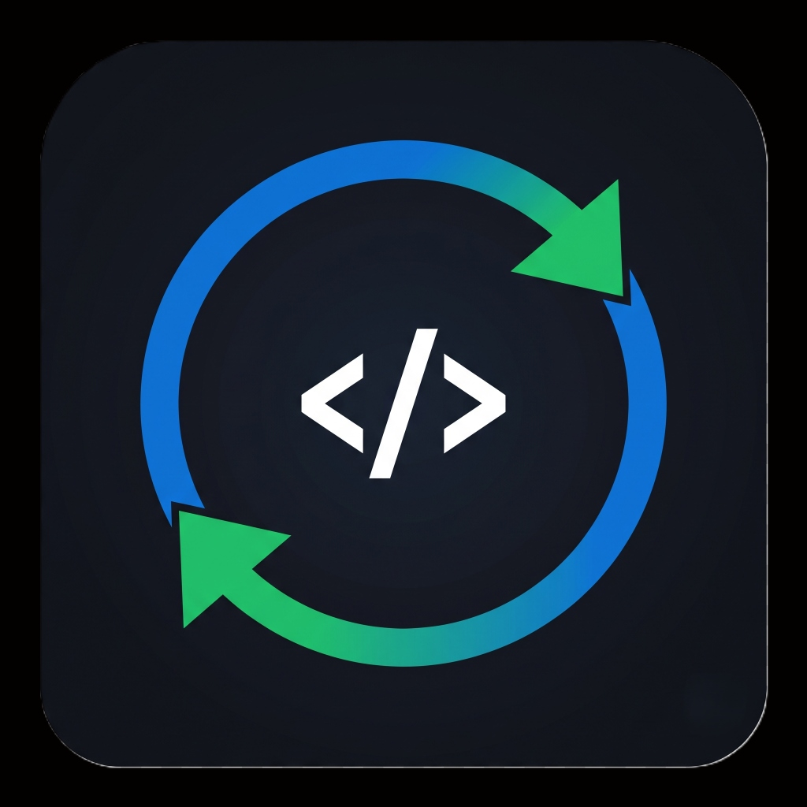

#  CodeSync
 

### Automatically sync your accepted coding solutions directly to your GitHub repository with a single click.

---

### 🚀 One Click • Secure OAuth • Automatic GitHub Commits

---

CodeSync is a browser extension that eliminates the repetitive process of manually copying coding solutions into GitHub. 

No manual copying. No downloading files. No Git commands. 
Just solve → sync.

---

## 🎯 Supported Platforms

| Platform | Status |
|----------|--------|
| ✅ LeetCode | Supported |
| ✅ GeeksforGeeks | Supported |
| ✅ HackerRank | Supported |
| 🚧 Codeforces | Planned |
| 🚧 AtCoder | Planned |
| 🚧 CodeChef | Planned |

---

## 📖 How to Use

1. **Install the Extension:** Add CodeSync to your browser.
2. **Connect GitHub:** Click the extension icon and authenticate with your GitHub account securely via OAuth.
3. **Select a Repository:** Choose an existing repository or let CodeSync create one for you.
4. **Solve and Sync:** Solve a problem on any supported platform. Once your solution is accepted, a floating "Sync" button will appear. Click it, and your code will instantly commit to your repository!

---

## 🚀 Installation

**Microsoft Edge / Google Chrome**
Install directly from the Add-ons Store or Chrome Web Store.
> *(Store Link coming soon)*

---

## ⭐ Support & Attribution

If you find CodeSync useful, consider giving the repository a ⭐. It helps more developers discover the project!

Developed by [orpheusdark](https://github.com/orpheusdark)
Copyright (c) 2026 orpheusdark. All rights reserved.
